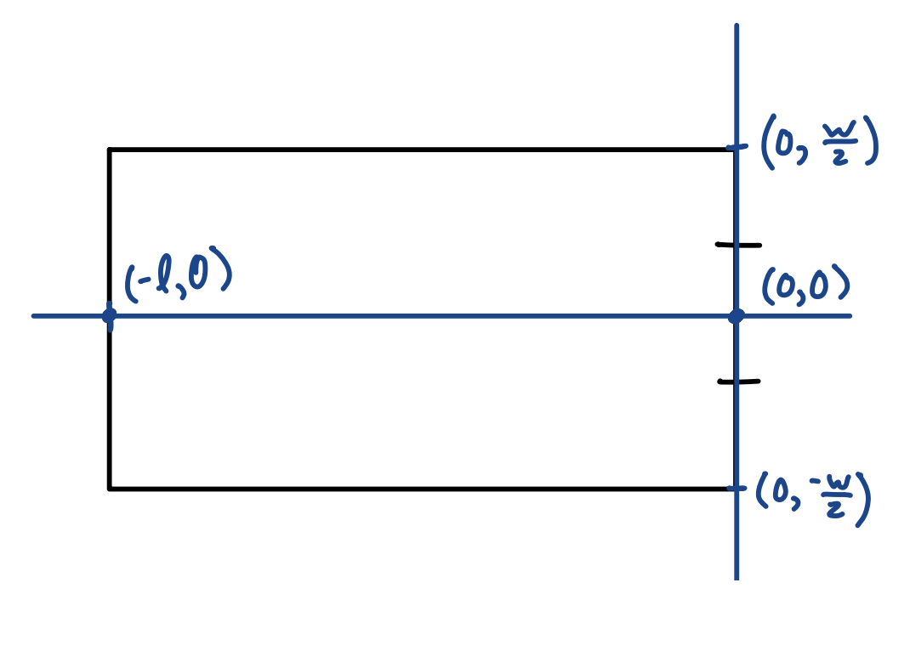

# BabyRobokeeper
under the guidance of elizabeth the pm

Coordinate system: 

# Setup:

`git clone https://github.com/uscmakers/BabyRobokeeper.git`

`pip3 install virtualenv`

`python3 -m venv env`

`source env/bin/activate`

`pip3 install numpy`

`pip3 install opencv-python`

`pip3 install matplotlib`

`pip3 install pyserial`